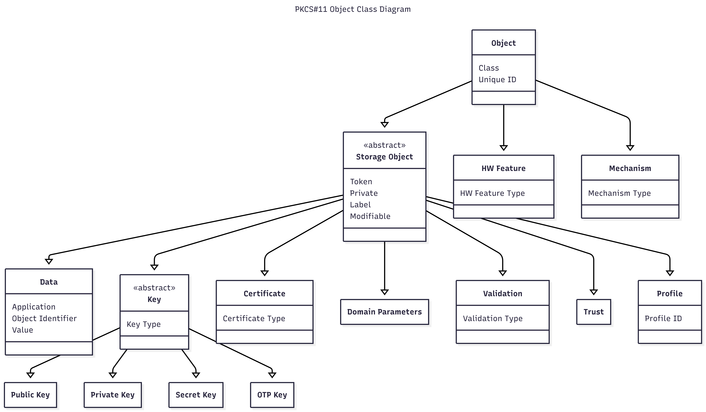

# Objects

Cryptoki recognizes a number of classes of objects, as defined in the
**CK_OBJECT_CLASS** data type. An object consists of a set of attributes,
each of which has a given value. Each attribute that an object possesses has
precisely one value. The following figure illustrates the high-level
hierarchy of the Cryptoki objects and some of the attributes they support:

{#figure_1}

Cryptoki provides functions for creating, destroying, and copying objects in
general, and for obtaining and modifying the values of their attributes.
Some of the cryptographic functions (e.g., **C_GenerateKey**) also create
key objects to hold their results.

Objects are always “well-formed” in Cryptoki—that is, an object always
contains all required attributes, and the attributes are always consistent
with one another from the time the object is created. This contrasts with
some object-based paradigms where an object has no attributes other than
perhaps a class when it is created, and is uninitialized for some time. In
Cryptoki, objects are always initialized.

Tables throughout most of Section [4][Objects] define each Cryptoki attribute
in terms of the data type of the attribute value and the meaning of the
attribute, which may include a default initial value. Some of the data types
are defined explicitly by Cryptoki (e.g., **CK_OBJECT_CLASS**). Attribute
values may also take the following types:

Byte array
: an arbitrary string (array) of **CK_BYTE**s

Big integer
: a string of **CK_BYTE**s representing an unsigned integer of arbitrary
  size, most-significant byte first (e.g., the integer 32768 is represented
  as the 2-byte string 0x80 0x00)

Local string
: an unpadded string of **CK_CHAR**s (see [Table 3]()) with no
  null-termination

RFC2279 string
: an unpadded string of **CK_UTF8CHAR**s with no null-termination

A token can hold several identical objects, i.e., it is permissible for two or
more objects to have exactly the same values for all their attributes.

In most cases each type of object in the Cryptoki specification possesses a
completely well-defined set of Cryptoki attributes. Some of these attributes
possess default values, and need not be specified when creating an object;
some of these default values may even be the empty string (“”). Nonetheless,
the object possesses these attributes. A given object has a single value for
each attribute it possesses, even if the attribute is a vendor-specific
attribute whose meaning is outside the scope of Cryptoki.

In addition to possessing Cryptoki attributes, objects may possess additional
vendor-specific attributes whose meanings and values are not specified by
Cryptoki.
