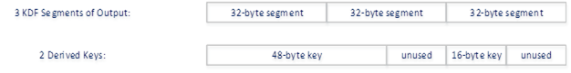

## SP800-108 Key Derivation

[NIST SP800-108] defines three types of key derivation functions (KDF); a
Counter Mode KDF, a Feedback Mode KDF and a Double Pipeline Mode KDF.

This section defines a unique mechanism for each type of KDF. These mechanisms
can be used to derive one or more symmetric keys from a single base symmetric
key. 

The KDFs defined in [NIST SP800-108] are all built upon pseudo random functions
(PRF). In general terms, the PRFs accepts two pieces of input; a base key and
some input data. The base key is taken from the hBaseKey parameter to
**C_DeriveKey**. The input data is constructed from an iteration variable
(internally defined by the KDF/PRF) and the data provided in the
**CK_PRF_DATA_PARAM** array that is part of the mechanism parameter.

+--------------------------------------+---------------------------------------------------+
|                                      | Functions                                         |
|                                      +-----+-----+------+-----+-------+-----+-----+------+
| Mechanism                            | ENC | SIG | SIGR |     | GENK  | WRP |     | ENCS |
|                                      |  &  |  &  |  &   | DIG |   &   |  &  | DRV |  &   |
|                                      | DEC | VER | VERR |     | GENKP | UWRP|     | DECS |
+======================================+:===:+:===:+:====:+:===:+:=====:+:===:+:===:+:====:+
| CKM_SP800_108_COUNTER_KDF            |     |     |      |     |       |     |  ✓  |      |
+--------------------------------------+-----+-----+------+-----+-------+-----+-----+------+
| CKM_SP800_108_FEEDBACK_KDF           |     |     |      |     |       |     |  ✓  |      |
+--------------------------------------+-----+-----+------+-----+-------+-----+-----+------+
| CKM_SP800_108_DOUBLE_PIPELINE_KDF    |     |     |      |     |       |     |  ✓  |      |
+--------------------------------------+-----+-----+------+-----+-------+-----+-----+------+
table: SP800-108 Mechanisms vs. Functions

For these mechanisms, the _ulMinKeySize_ and _ulMaxKeySize_ fields of the
**CK_MECHANISM_INFO** structure specify the minimum and maximum supported base
key size in bits. Note, these mechanisms support multiple PRF types and key
types; as such the values reported by ulMinKeySize and ulMaxKeySize specify the
minimum and maximum supported base key size when all PRF and keys types are
considered. For example, a Cryptoki implementation may support
**CKK_GENERIC_SECRET** keys that can be as small as 8-bits in length and
therefore ulMinKeySize could report 8-bits. However, for an AES-CMAC PRF the
base key must be of type **CKK_AES** and must be either 16-bytes, 24-bytes or
32-bytes in lengths and therefore the value reported by ulMinKeySize could be
misleading. Depending on the PRF type selected, additional key size restrictions
may apply.

### Definitions

Mechanisms:

- CKM_SP800_108_COUNTER_KDF
- CKM_SP800_108_FEEDBACK_KDF
- CKM_SP800_108_DOUBLE_PIPELINE_KDF

Data Field Types:

- CK_SP800_108_ITERATION_VARIABLE
- CK_SP800_108_COUNTER
- CK_SP800_108_DKM_LENGTH
- CK_SP800_108_BYTE_ARRAY

DKM Length Methods:
- CK_SP800_108_DKM_LENGTH_SUM_OF_KEYS
- CK_SP800_108_DKM_LENGTH_SUM_OF_SEGMENTS

### Mechanism Parameters

#### CK_SP800_108_PRF_TYPE
\  

The **CK_SP800_108_PRF_TYPE** field of the mechanism parameter is used to
specify the type of PRF that is to be used. It is defined as follows:

~~~{.c}
typedef CK_MECHANISM_TYPE CK_SP800_108_PRF_TYPE;
~~~

The **CK_SP800_108_PRF_TYPE** field reuses the existing mechanisms definitions.
The following table lists the supported PRF types:

| Pseudo Random Function Identifiers |
|------------------------------------|
| CKM_SHA_1_HMAC                     |
| CKM_SHA224_HMAC                    |
| CKM_SHA256_HMAC                    |
| CKM_SHA384_HMAC                    |
| CKM_SHA512_HMAC                    |
| CKM_SHA3_224_HMAC                  |
| CKM_SHA3_256_HMAC                  |
| CKM_SHA3_384_HMAC                  |
| CKM_SHA3_512_HMAC                  |
| CKM_DES3_CMAC                      |
| CKM_AES_CMAC                       |
table: SP800-108 Pseudo Random Functions

#### CK_PRF_DATA_TYPE
\  

Each mechanism parameter contains an array of **CK_PRF_DATA_PARAM** structures.
The **CK_PRF_DATA_PARAM** structure contains **CK_PRF_DATA_TYPE** field. The
**CK_PRF_DATA_TYPE** field is used to identify the type of data identified by
each **CK_PRF_DATA_PARAM** element in the array. Depending on the type of KDF
used, some data field types are mandatory, some data field types are optional
and some data field types are not allowed. These requirements are defined on a
per-mechanism basis in the sections below. The **CK_PRF_DATA_TYPE** is defined
as follows:

~~~{.c}
typedef CK_ULONG CK_PRF_DATA_TYPE;
~~~

The following table lists all of the supported data field types:

| Data Field Identifier           | Description                          |
|---------------------------------|--------------------------------------|
| CK_SP800_108_ITERATION_VARIABLE | Identifies the iteration variable defined internally by the KDF. |
| CK_SP800_108_COUNTER            | Identifies an optional counter value represented as a binary string. Exact formatting of the counter value is defined by the CK_SP800_108_COUNTER_FORMAT structure. The value of the counter is defined by the KDF’s internal loop counter. |
| CK_SP800_108_DKM_LENGTH         | Identifies the length in bits of the derived keying material (DKM) represented as a binary string. Exact formatting of the length value is defined by the CK_SP800_108_DKM_LENGTH_FORMAT structure. |
| CK_SP800_108_BYTE_ARRAY         | Identifies a generic byte array of data. This data type can be used to provide “context”, “label”, “separator bytes” as well as any other type of encoding information required by the higher level protocol. |
| CK_SP800_108_KEY_HANDLE         | Identifies the key handle for an object with CK_OBJECT_CLASS set to **CKO_SECRET_KEY**. If specified, this data type will be interpreted as an instance of CK_BYTE_ARRAY where pValue points to the buffer containing the **CKA_VALUE** attribute of the provided key handle, and ulValueLen is assigned the value of the **CKA_VALUE_LEN** attribute of the provided key handle. |V
The specified key handle must have attributes settings consistent with a key that would allow it to be used as a base key for this key derivation mechanism.
table: SP800-108 PRF Data Field Types

#### CK_PRF_DATA_PARAM
\  

**CK_PRF_DATA_PARAM** is used to define a segment of input for the PRF. Each
mechanism parameter supports an array of **CK_PRF_DATA_PARAM** structures. The
**CK_PRF_DATA_PARAM** is defined as follows:

~~~{.c}
typedef struct CK_PRF_DATA_PARAM
{
  CK_PRF_DATA_TYPE    type;
  CK_VOID_PTR         pValue;
  CK_ULONG            ulValueLen;
} CK_PRF_DATA_PARAM;

typedef CK_PRF_DATA_PARAM CK_PTR CK_PRF_DATA_PARAM_PTR;
~~~

The fields of the **CK_PRF_DATA_PARAM** structure have the following meaning:

_type_
: defines the type of data pointed to by pValue

_pValue_
: pointer to the data defined by type

_ulValueLen_
: size of the data pointed to by pValue

If the _type_ field of the **CK_PRF_DATA_PARAM** structure is set to
**CK_SP800_108_ITERATION_VARIABLE**, then _pValue_ must be set the appropriate
value for the KDF’s iteration variable type. For the Counter Mode KDF, _pValue_
must be assigned a valid **CK_SP800_108_COUNTER_FORMAT_PTR** and _ulValueLen_
must be set to sizeof(CK_SP800_108_COUNTER_FORMAT). For all other KDF types,
_pValue_ must be set to NULL_PTR and ulValueLen must be set to 0.

If the _type_ field of the **CK_PRF_DATA_PARAM** structure is set to
**CK_SP800_108_COUNTER**, then _pValue_ must be assigned a valid
**CK_SP800_108_COUNTER_FORMAT_PTR** and _ulValueLen_ must be set to
sizeof(CK_SP800_108_COUNTER_FORMAT). 

If the _type_ field of the **CK_PRF_DATA_PARAM** structure is set to
**CK_SP800_108_DKM_LENGTH** then _pValue_ must be assigned a valid
**CK_SP800_108_DKM_LENGTH_FORMAT_PTR** and _ulValueLen_ must be set to
sizeof(CK_SP800_108_DKM_LENGTH_FORMAT). 

If the _type_ field of the **CK_PRF_DATA_PARAM** structure is set to
**CK_SP800_108_BYTE_ARRAY**, then _pValue_ must be assigned a valid
**CK_BYTE_PTR** value and _ulValueLen_ must be set to a non-zero length.

If the _type_ field of the **CK_PRF_DATA_PARAM** structure is set to
**CK_SP800_108_KEY_HANDLE**, then _pValue_ must be assigned a valid
**CK_OBJECT_HANDLE_PTR** value and _ulValueLen_ must be set to
sizeof(CK_OBJECT_HANDLE).

#### CK_SP800_108_COUNTER_FORMAT
\  

**CK_SP800_108_COUNTER_FORMAT** is used to define the encoding format for a
counter value. The **CK_SP800_108_COUNTER_FORMAT** is defined as follows:

~~~{.c}
typedef struct CK_SP800_108_COUNTER_FORMAT
{ 
   CK_BBOOL    bLittleEndian;
   CK_ULONG    ulWidthInBits;
} CK_SP800_108_COUNTER_FORMAT;

typedef CK_SP800_108_COUNTER_FORMAT CK_PTR CK_SP800_108_COUNTER_FORMAT_PTR;
~~~

The fields of the **CK_SP800_108_COUNTER_FORMAT** structure have the following
meaning:

_bLittleEndian_
: defines if the counter should be represented in Big Endian or Little Endian
  format 

_ulWidthInBits_
: defines the number of bits used to represent the counter value	

#### CK_SP800_108_DKM_LENGTH_METHOD
\  

**CK_SP800_108_DKM_LENGTH_METHOD** is used to define how the DKM length value is
calculated. The **CK_SP800_108_DKM_LENGTH_METHOD** type is defined as follows:

~~~{.c}
typedef CK_ULONG CK_SP800_108_DKM_LENGTH_METHOD;
~~~

The following table lists all of the supported DKM Length Methods:

| DKM Length Method Identifier | Description                             |
|------------------------------|-----------------------------------------|
| CK_SP800_108_DKM_LENGTH_SUM_OF_KEYS | Specifies that the DKM length should be set to the sum of the length of all keys derived by this invocation of the KDF. |
| CK_SP800_108_DKM_LENGTH_SUM_OF_SEGMENTS | Specifies that the DKM length should be set to the sum of the length of all segments of output produced by the PRF by this invocation of the KDF.= |
table: SP800-108 DKM Length Methods

#### CK_SP800_108_DKM_LENGTH_FORMAT
\  

**CK_SP800_108_DKM_LENGTH_FORMAT** is used to define the encoding format for the
DKM length value. The **CK_SP800_108_DKM_LENGTH_FORMAT** is defined as follows:

~~~{.C}
typedef struct CK_SP800_108_DKM_LENGTH_FORMAT
{ 
  CK_SP800_108_DKM_LENGTH_METHOD  dkmLengthMethod;
  CK_BBOOL                        bLittleEndian;
  CK_ULONG                        ulWidthInBits;
} CK_SP800_108_DKM_LENGTH_FORMAT;

typedef CK_SP800_108_DKM_LENGTH_FORMAT CK_PTR CK_SP800_108_DKM_LENGTH_FORMAT_PTR;
~~~

The fields of the **CK_SP800_108_DKM_LENGTH_FORMAT** structure have the
following meaning:

_dkmLengthMethod_
: defines the method used to calculate the DKM length value

_bLittleEndian_
: defines if the DKM length value should be represented in Big Endian or Little
  Endian format 

_ulWidthInBits_
: defines the number of bits used to represent the DKM length value	

#### CK_DERIVED_KEY
\  

**CK_DERIVED_KEY** is used to define an additional key to be derived as well as
provide a **CK_OBJECT_HANDLE_PTR** to receive the handle for the derived keys.
The **CK_DERIVED_KEY** is defined as follows:

~~~{.c}
typedef struct CK_DERIVED_KEY
{
  CK_ATTRIBUTE_PTR     pTemplate;
  CK_ULONG             ulAttributeCount;
  CK_OBJECT_HANDLE_PTR phKey;
} CK_DERIVED_KEY;

typedef CK_DERIVED_KEY CK_PTR CK_DERIVED_KEY_PTR;
~~~

The fields of the **CK_DERIVED_KEY** structure have the following meaning:

_pTemplate_
: pointer to a template that defines a key to derive

_ulAttributeCount_
: number of attributes in the template pointed to by pTemplate

_phKey_
: pointer to receive the handle for a derived key

#### CK_SP800_108_KDF_PARAMS
\  

**CK_SP800_108_KDF_PARAMS** is a structure that provides the parameters for the
**CKM_SP800_108_COUNTER_KDF** and **CKM_SP800_108_DOUBLE_PIPELINE_KDF**
mechanisms. 

~~~{.c}
typedef struct CK_SP800_108_KDF_PARAMS
{
  CK_SP800_108_PRF_TYPE  prfType;
  CK_ULONG               ulNumberOfDataParams;
  CK_PRF_DATA_PARAM_PTR  pDataParams;
  CK_ULONG               ulAdditionalDerivedKeys;
  CK_DERIVED_KEY_PTR     pAdditionalDerivedKeys;
} CK_SP800_108_KDF_PARAMS;

typedef CK_SP800_108_KDF_PARAMS CK_PTR CK_SP800_108_KDF_PARAMS_PTR;
~~~

The fields of the **CK_SP800_108_KDF_PARAMS** structure have the following
meaning:

_prfType_
: type of PRF

_ulNumberOfDataParams_
: number of elements in the array pointed to by pDataParams

_pDataParams_
: an array of CK_PRF_DATA_PARAM structures. The array defines input
  parameters that are used to construct the “data” input to the PRF.

_ulAdditionalDerivedKeys_
: number of additional keys that will be derived and the number of elements in
  the array pointed to by pAdditionalDerivedKeys. If pAdditionalDerivedKeys is
  set to NULL_PTR, this parameter must be set to 0.

_pAdditionalDerivedKeys_
: an array of CK_DERIVED_KEY structures. If ulAdditionalDerivedKeys is set to 0,
  this parameter must be set to NULL_PTR

#### CK_SP800_108_FEEDBACK_KDF_PARAMS
\  

The **CK_SP800_108_FEEDBACK_KDF_PARAMS** structure provides the parameters for
the **CKM_SP800_108_FEEDBACK_KDF** mechanism. It is defined as follows:

~~~{.c}
typedef struct CK_SP800_108_FEEDBACK_KDF_PARAMS
{
  CK_SP800_108_PRF_TYPE  prfType;
  CK_ULONG               ulNumberOfDataParams;
  CK_PRF_DATA_PARAM_PTR  pDataParams;
  CK_ULONG               ulIVLen;
  CK_BYTE_PTR            pIV;
  CK_ULONG               ulAdditionalDerivedKeys;
  CK_DERIVED_KEY_PTR     pAdditionalDerivedKeys;
} CK_SP800_108_FEEDBACK_KDF_PARAMS;

typedef CK_SP800_108_FEEDBACK_KDF_PARAMS CK_PTR CK_SP800_108_FEEDBACK_KDF_PARAMS_PTR;
~~~

The fields of the **CK_SP800_108_FEEDBACK_KDF_PARAMS** structure have the
following meaning:

_prfType_
: type of PRF

_ulNumberOfDataParams_
: number of elements in the array pointed to by pDataParams

_pDataParams_
: an array of CK_PRF_DATA_PARAM structures. The array defines input parameters
  that are used to construct the “data” input to the PRF.

_ulIVLen_
: the length in bytes of the IV. If pIV is set to NULL_PTR, this parameter must
  be set to 0.

_pIV_
: an array of bytes to be used as the IV for the feedback mode KDF. This
  parameter is optional and can be set to NULL_PTR. If ulIVLen is set to 0, this
  parameter must be set to NULL_PTR.

_ulAdditionalDerivedKeys_
: number of additional keys that will be derived and the number of elements in
  the array pointed to by pAdditionalDerivedKeys. If pAdditionalDerivedKeys is
  set to NULL_PTR, this parameter must be set to 0.

_pAdditionalDerivedKeys_
: an array of CK_DERIVED_KEY structures. If ulAdditionalDerivedKeys is set to 0,
  this parameter must be set to NULL_PTR.

### Counter Mode KDF

The SP800-108 Counter Mode KDF mechanism, denoted **CKM_SP800_108_COUNTER_KDF**,
represents the KDF defined in [NIST SP800-108] section [5.1].
**CKM_SP800_108_COUNTER_KDF** is a mechanism for deriving one or more symmetric
keys from a symmetric base key.

It has a parameter, a **CK_SP800_108_KDF_PARAMS** structure.

The following table lists the data field types that are supported for this KDF
type and their meaning:

| Data Field Identifier           | Description                          |
|---------------------------------|--------------------------------------|
| CK_SP800_108_ITERATION_VARIABLE | This data field type is mandatory.   |
|                                 | This data field type identifies the location of the iteration variable in the constructed PRF input data. |
|                                 | The iteration variable for this KDF type is a counter. |
|                                 | Exact formatting of the counter value is defined by the CK_SP800_108_COUNTER_FORMAT structure. |
| CK_SP800_108_COUNTER            | This data field type is invalid for this KDF type. |
| CK_SP800_108_DKM_LENGTH         | This data field type is optional. |
|                                 | This data field type identifies the location of the DKM length  in the constructed PRF input data.| 
|                                 | Exact formatting of the DKM length is defined by the CK_SP800_108_DKM_LENGTH_FORMAT structure. |
|                                 | If specified, only one instance of this type may be specified. |
| CK_SP800_108_BYTE_ARRAY         | This data field type is optional. |
|                                 | This data field type identifies the location and value of a byte array of data in the constructed PRF input data. |
|                                 | This standard does not restrict the number of instances of this data type. |
| CK_SP800_108_KEY_HANDLE         | This data field type is optional. |
|                                 | This data field type identifies the location of a symmetric key value in the constructed PRF input data. |
|                                 | This standard does not restrict the number of instances of this data type. |
|                                 | This standard does not restrict the same key handle being defined multiple times. |
table: Counter Mode data field requirements
 
[NIST SP800-108] limits the amount of derived keying material that can be
produced by a Counter Mode KDF by limiting the internal loop counter to
(2^r^−1), where “r” is the number of bits used to represent the counter.
Therefore the maximum number of bits that can be produced is (2^r^−1)h, where
“h” is the length in bits of the output of the selected PRF.

### Feedback Mode KDF

The SP800-108 Feedback Mode KDF mechanism, denoted
**CKM_SP800_108_FEEDBACK_KDF**, represents the KDF defined in [NIST SP800-108]
section [5.2]. **CKM_SP800_108_FEEDBACK_KDF** is a mechanism for deriving one or
more symmetric keys from a symmetric base key.

It has a parameter, a **CK_SP800_108_FEEDBACK_KDF_PARAMS** structure.

The following table lists the data field types that are supported for this KDF
type and their meaning:

| Data Field Identifier           | Description                          |
|---------------------------------|--------------------------------------|
| CK_SP800_108_ITERATION_VARIABLE | This data field type is mandatory.   |
|                                 | This data field type identifies the location of the iteration variable in the constructed PRF input data. |
|                                 | The iteration variable is defined as K(i-1) in section 5.2 of [NIST SP800-108]. |
|                                 | The size, format and value of this data input is defined by the internal KDF structure and PRF output. |
|                                 | Exact formatting of the counter value is defined by the CK_SP800_108_COUNTER_FORMAT structure. |
| CK_SP800_108_COUNTER            | This data field type is optional.    |
|                                 | This data field type identifies the location of the counter in the constructed PRF input data. |
|                                 | Exact formatting of the counter value is defined by the CK_SP800_108_COUNTER_FORMAT structure. |
|                                 | If specified, only one instance of this type may be specified. |
| CK_SP800_108_DKM_LENGTH         | This data field type is optional.    |
|                                 | This data field type identifies the location of the DKM length in the constructed PRF input data. |
|                                 | Exact formatting of the DKM length is defined by the CK_SP800_108_DKM_LENGTH_FORMAT structure. |
|                                 | If specified, only one instance of this type may be specified. |
| CK_SP800_108_BYTE_ARRAY         | This data field type is optional.    |
|                                 | This data field type identifies the location and value of a byte array of data in the constructed PRF input data. |
|                                 | This standard does not restrict the number of instances of this data type. |
| CK_SP800_108_KEY_HANDLE         | This data field type is optional.    |
|                                 | This data field type identifies the location of a symmetric key value in the constructed PRF input data. |
|                                 | This standard does not restrict the number of instances of this data type. |
|                                 | This standard does not restrict the same key handle being defined multiple times. |
table: Feedback Mode data field requirements

[NIST SP800-108] limits the amount of derived keying material that can be
produced by a Feedback Mode KDF by limiting the internal loop counter to
(2^32^−1). Therefore the maximum number of bits that can be produced is
(2^32^−1)h, where “h” is the length in bits of the output of the selected PRF.

### Double Pipeline Mode KDF

The SP800-108 Double Pipeline Mode KDF mechanism, denoted
**CKM_SP800_108_DOUBLE_PIPELINE_KDF**, represents the KDF defined [NIST
SP800-108] section [5.3]. **CKM_SP800_108_DOUBLE_PIPELINE_KDF** is a mechanism
for deriving one or more symmetric keys from a symmetric base key.

It has a parameter, a **CK_SP800_108_KDF_PARAMS** structure.

The following table lists the data field types that are supported for this KDF
type and their meaning:

| Data Field Identifier           | Description                          |
|---------------------------------|--------------------------------------|
| CK_SP800_108_ITERATION_VARIABLE | This data field type is mandatory.   |
|                                 | This data field type identifies the location of the iteration variable in the constructed PRF input data. |
|                                 | The iteration variable is defined as A(i) in section 5.3 of [NIST SP800-108]. |
|                                 | The size, format and value of this data input is defined by the internal KDF structure and PRF output. |
|                                 | Exact formatting of the counter value is defined by the CK_SP800_108_COUNTER_FORMAT structure. |
| CK_SP800_108_COUNTER            | This data field type is optional.    |
|                                 | This data field type identifies the location of the counter in the constructed PRF input data. |
|                                 | Exact formatting of the counter value is defined by the CK_SP800_108_COUNTER_FORMAT structure. |
|                                 | If specified, only one instance of this type may be specified. |
| CK_SP800_108_DKM_LENGTH         | This data field type is optional.    |
|                                 | This data field type identifies the location of the DKM length in the constructed PRF input data. |
|                                 | Exact formatting of the DKM length is defined by the CK_SP800_108_DKM_LENGTH_FORMAT structure. |
|                                 | If specified, only one instance of this type may be specified. |
| CK_SP800_108_BYTE_ARRAY         | This data field type is optional.    |
|                                 | This data field type identifies the location and value of a byte array of data in the constructed PRF input data. |
|                                 | This standard does not restrict the number of instances of this data type. |
| CK_SP800_108_KEY_HANDLE         | This data field type is optional.    |
|                                 | This data field type identifies the location of a symmetric key value in the constructed PRF input data. |
|                                 | This standard does not restrict the number of instances of this data type. |
|                                 | This standard does not restrict the same key handle being defined multiple times. |
table: Double Pipeline Mode data field requirements

[NIST SP800-108] limits the amount of derived keying material that can be
produced by a Double-Pipeline Mode KDF by limiting the internal loop counter to
(2^32^−1). Therefore the maximum number of bits that can be produced is
(2^32^−1)h, where “h” is the length in bits of the output of the selected PRF.

The Double Pipeline KDF requires an internal IV value. The IV is constructed
using the same method used to construct the PRF input data; the data/values
identified by the array of **CK_PRF_DATA_PARAM** structures are concatenated in
to a byte array that is used as the IV. As shown in [NIST SP800-108] section
[5.3], the **CK_SP800_108_ITERATION_VARIABLE** and **CK_SP800_108_COUNTER** data
field types are not included in IV construction process. All other data field
types are included in the construction process.

### Deriving Additional Keys

The KDFs defined in this section can be used to derive more than one symmetric
key from the base key. The **C_DeriveKey** function accepts one
**CK_ATTRIBUTE_PTR** to define a single derived key and one
**CK_OBJECT_HANDLE_PTR** to receive the handle for the derived key.

To derive additional keys, the mechanism parameter structure can be filled in
with one or more **CK_DERIVED_KEY** structures. Each structure contains a
**CK_ATTRIBUTE_PTR** to define a derived key and a **CK_OBJECT_HANDLE_PTR** to
receive the handle for the additional derived keys. The key defined by the
**C_DeriveKey** function parameters is always derived before the keys defined by
the **CK_DERIVED_KEY** array that is part of the mechanism parameter. The
additional keys that are defined by the **CK_DERIVED_KEY** array are derived in
the order they are defined in the array. That is to say that the derived keying
material produced by the KDF is processed from left to right, and bytes are
assigned first to the key defined by the **C_DeriveKey** function parameters,
and then bytes are assigned to the keys that are defined by the
**CK_DERIVED_KEY** array in the order they are defined in the array.

Each internal iteration of a KDF produces a unique segment of PRF output.
Sometimes, a single iteration will produce enough keying material for the key
being derived. Other times, additional internal iterations are performed to
produce multiple segments which are concatenated together to produce enough
keying material for the derived key(s). 

When deriving multiple keys, no key can be created using part of a segment that
was used for another key. All keys must be created from disjoint segments. For
example, if the parameters are defined such that a 48-byte key (defined by the
**C_DeriveKey** function parameters) and a 16-byte key (defined by the content
of **CK_DERIVED_KEY)** are to be derived using **CKM_SHA256_HMAC** as a PRF,
three internal iterations of the KDF will be performed and three segments of PRF
output will be produced. The first segment and half of the second segment will
be used to create the 48-byte key and the third segment will be used to create
the 16-byte key.

{#figure_2}

In the above example, if the **CK_SP800_108_DKM_LENGTH** data field type is
specified with method **CK_SP800_108_DKM_LENGTH_SUM_OF_KEYS**, then the DKM
length value will be 512 bits. If the **CK_SP800_108_DKM_LENGTH** data field
type is specified with method **CK_SP800_108_DKM_LENGTH_SUM_OF_SEGMENTS**, then
the DKM length value will be 768 bits.  When deriving multiple keys, if any of
the keys cannot be derived for any reason, none of the keys shall be derived. If
the failure was caused by the content of a specific key’s template (ie the
template defined by the content of pTemplate), the corresponding phKey value
will be set to **CK_INVALID_HANDLE** to identify the offending template.

### Key Derivation Attribute Rules

The **CKM_SP800_108_COUNTER_KDF**, **CKM_SP800_108_FEEDBACK_KDF** and
**CKM_SP800_108_DOUBLE_PIPELINE_KDF** mechanisms have the following rules about
key sensitivity and extractability:

- The **CKA_SENSITIVE** and **CKA_EXTRACTABLE** attributes in the template for
  the derived key(s) can both be specified to be either CK_TRUE or CK_FALSE. If
  omitted, these attributes each take on the value of these attributes as they
  are defined in the base key.
- If the base key or any of the additional input keys have their
  **CKA_ALWAYS_SENSITIVE** attribute set to CK_TRUE, then the derived keys will
  have their **CKA_ALWAYS_SENSITIVE** attribute set to the same value as their
  **CKA_SENSITIVE** attribute. Otherwise the derived keys will have their
  **CKA_ALWAYS_SENSITIVE** attribute set to CK_FALSE.
- If the base key or any of the additional input keys have their
  **CKA_NEVER_EXTRACTABLE** attribute set to CK_TRUE, then the derived key will
  have their **CKA_NEVER_EXTRACTABLE** attribute set to the opposite value from
  their **CKA_EXTRACTABLE** attribute. Otherwise, the derived keys will have
  their **CKA_NEVER_EXTRACTABLE** attribute set to CK_FALSE.

### Constructing PRF Input Data

[NIST SP800-108] defines the PRF input data for each KDF at a high level using
terms like “label”, “context”, “separator”, “counter”…etc. The value, formatting
and order of the input data is not strictly defined by [NIST SP800-108], instead
it is described as being defined by the “encoding scheme”.

To support any encoding scheme, these mechanisms construct the PRF input data
from from the array of CK_PRF_DATA_PARAM structures in the mechanism parameter.
All of the values defined by the CK_PRF_DATA_PARAM array are concatenated in the
order they are defined and passed in to the PRF as the data parameter.

### Sample Counter Mode KDF

[NIST SP800-108] section 5.1 outlines a sample Counter Mode KDF which defines
the following PRF input:

PRF(_K~I~_, [_i_]~2~ || _Label_ || _0x00_ || _Context_ || [_L_]~2~)

Section [5.1] does not define the number of bits used to represent the counter
(the “r” value) or the DKM length (the “L” value), so 16-bits is assumed for
both cases. The following sample code shows how to define this PRF input data
using an array of CK_PRF_DATA_PARAM structures.

~~~{.c}
#define DIM(a) (sizeof((a))/sizeof((a)[0]))

CK_OBJECT_HANDLE hBaseKey;
CK_OBJECT_HANDLE hDerivedKey;
CK_OBJECT_HANDLE hAdditionalInputKey;
CK_ATTRIBUTE derivedKeyTemplate = { … };

CK_BYTE baLabel[] = {0xde, 0xad, 0xbe , 0xef};
CK_ULONG ulLabelLen = sizeof(baLabel);
CK_BYTE baContext[] = {0xfe, 0xed, 0xbe , 0xef};
CK_ULONG ulContextLen = sizeof(baContext);

CK_SP800_108_COUNTER_FORMAT counterFormat = {0, 16};
CK_SP800_108_DKM_LENGTH_FORMAT dkmFormat 
   = {CK_SP800_108_DKM_LENGTH_SUM_OF_KEYS, 0, 16};

CK_PRF_DATA_PARAM dataParams[] =
{
   { CK_SP800_108_ITERATION_VARIABLE,
     &counterFormat, sizeof(counterFormat) },
   { CK_SP800_108_BYTE_ARRAY, baLabel, ulLabelLen },
   { CK_SP800_108_BYTE_ARRAY, {0x00}, 1 },
   { CK_SP800_108_BYTE_ARRAY, baContext, ulContextLen },
   { CK_SP800_108_KEY_HANDLE, &hAdditionalInputKey, sizeof(hAdditionalInputKey) },
   { CK_SP800_108_DKM_LENGTH, dkmFormat, sizeof(dkmFormat) }
};

CK_SP800_108_KDF_PARAMS kdfParams =
{
   CKM_AES_CMAC,
   DIM(dataParams),
   &dataParams,
   0,	/* no addition derived keys */
   NULL	/* no addition derived keys */
};

CK_MECHANISM = mechanism
{
   CKM_SP800_108_COUNTER_KDF,
   &kdfParams,
   sizeof(kdfParams)
};

hBaseKey = GetBaseKeyHandle(.....);

hAdditionalInputKey = GetAdditionalInputKeyHandle(.....);

rv = C_DeriveKey(
   hSession,
   &mechanism,
   hBaseKey,
   &derivedKeyTemplate,
   DIM(derivedKeyTemplate),
   &hDerivedKey);
~~~

### Sample SCP03 Counter Mode KDF

The SCP03 standard defines a variation of a counter mode KDF which defines the
following PRF input: 

PRF(_K~I~_, _Label_ || _0x00_ || [_L_]~2~ || [_i_]~2~ || _Context_) 

SCP03 defines the number of bits used to represent the counter (the “r” value)
and number of bits used to represent the DKM length (the “L” value) as 16-bits.
The following sample code shows how to define this PRF input data using an array
of CK_PRF_DATA_PARAM structures.

~~~{.c}
#define DIM(a) (sizeof((a))/sizeof((a)[0]))

CK_OBJECT_HANDLE hBaseKey;
CK_OBJECT_HANDLE hDerivedKey;
CK_ATTRIBUTE derivedKeyTemplate = { … };

CK_BYTE baLabel[] = {0xde, 0xad, 0xbe , 0xef};
CK_ULONG ulLabelLen = sizeof(baLabel);
CK_BYTE baContext[] = {0xfe, 0xed, 0xbe , 0xef};
CK_ULONG ulContextLen = sizeof(baContext);

CK_SP800_108_COUNTER_FORMAT counterFormat = {0, 16};
CK_SP800_108_DKM_LENGTH_FORMAT dkmFormat 
   = {CK_SP800_108_DKM_LENGTH_SUM_OF_KEYS, 0, 16};

CK_PRF_DATA_PARAM dataParams[] =
{
   { CK_SP800_108_BYTE_ARRAY, baLabel, ulLabelLen },
   { CK_SP800_108_BYTE_ARRAY, {0x00}, 1 }, 
   { CK_SP800_108_DKM_LENGTH, dkmFormat, sizeof(dkmFormat) },
   { CK_SP800_108_ITERATION_VARIABLE,
     &counterFormat, sizeof(counterFormat) },
   { CK_SP800_108_BYTE_ARRAY, baContext, ulContextLen }
};

CK_SP800_108_KDF_PARAMS kdfParams =
{
   CKM_AES_CMAC,
   DIM(dataParams),
   &dataParams,
   0,	/* no addition derived keys */
   NULL	/* no addition derived keys */
};

CK_MECHANISM = mechanism
{
   CKM_SP800_108_COUNTER_KDF,
   &kdfParams,
   sizeof(kdfParams)
};

hBaseKey = GetBaseKeyHandle(.....);

rv = C_DeriveKey(
   hSession,
   &mechanism,
   hBaseKey,
   &derivedKeyTemplate,
   DIM(derivedKeyTemplate),
   &hDerivedKey);
~~~

### Sample Feedback Mode KDF

[NIST SP800-108] section 5.2 outlines a sample Feedback Mode KDF which defines
the following PRF input: 

PRF(_K~I~_, _K~(I-1)~_ {|| [_i_]~2~ }|| _Label_ || _0x00_ || _Context_ || [_L_]~2~) 

Section [5.2] does not define the number of bits used to represent the counter
(the “r” value) or the DKM length (the “L” value), so 16-bits is assumed for
both cases. The counter is defined as being optional and is included in this
example. The following sample code shows how to define this PRF input data using
an array of CK_PRF_DATA_PARAM structures.

~~~{.c}
#define DIM(a) (sizeof((a))/sizeof((a)[0]))

CK_OBJECT_HANDLE hBaseKey;
CK_OBJECT_HANDLE hDerivedKey;
CK_ATTRIBUTE derivedKeyTemplate = { … };

CK_BYTE baFeedbackIV[] = {0x01, 0x02, 0x03, 0x04};
CK_ULONG ulFeedbackIVLen = sizeof(baFeedbackIV);
CK_BYTE baLabel[] = {0xde, 0xad, 0xbe, 0xef};
CK_ULONG ulLabelLen = sizeof(baLabel);
CK_BYTE baContext[] = {0xfe, 0xed, 0xbe, 0xef};
CK_ULONG ulContextLen = sizeof(baContext);

CK_SP800_108_COUNTER_FORMAT counterFormat = {0, 16};
CK_SP800_108_DKM_LENGTH_FORMAT dkmFormat 
   = {CK_SP800_108_DKM_LENGTH_SUM_OF_KEYS, 0, 16};

CK_PRF_DATA_PARAM dataParams[] =
{
   { CK_SP800_108_ITERATION_VARIABLE,
     &counterFormat, sizeof(counterFormat) },
   { CK_SP800_108_BYTE_ARRAY, baLabel, ulLabelLen },
   { CK_SP800_108_BYTE_ARRAY, {0x00}, 1 },
   { CK_SP800_108_BYTE_ARRAY, baContext, ulContextLen },
   { CK_SP800_108_DKM_LENGTH, dkmFormat, sizeof(dkmFormat) }
};

CK_SP800_108_FEEDBACK_KDF_PARAMS kdfParams =
{
   CKM_AES_CMAC,
   DIM(dataParams),
   &dataParams,
   ulFeedbackIVLen,
   baFeedbackIV,
   0,	/* no addition derived keys */
   NULL	/* no addition derived keys */
};

CK_MECHANISM = mechanism
{
   CKM_SP800_108_FEEDBACK_KDF,
   &kdfParams,
   sizeof(kdfParams)
};

hBaseKey = GetBaseKeyHandle(.....);

rv = C_DeriveKey(
   hSession,
   &mechanism,
   hBaseKey,
   &derivedKeyTemplate,
   DIM(derivedKeyTemplate),
   &hDerivedKey);
~~~

### Sample Double-Pipeline Mode KDF

[NIST SP800-108] section 5.3 outlines a sample Double-Pipeline Mode KDF which
defines the two following PRF inputs: 

PRF(_K~I~_, _A~(i-1)~_) 
PRF(_K~I~_, _K~(i-1)~_ {|| [_i_]~2~ }|| _Label_ || _0x00_ || _Context_ || [_L_]~2~) 

Section [5.3] does not define the number of bits used to represent the counter
(the “r” value) or the DKM length (the “L” value), so 16-bits is assumed for
both cases. The counter is defined as being optional so it is left out in this
example. The following sample code shows how to define this PRF input data using
an array of CK_PRF_DATA_PARAM structures.

~~~{.c}
#define DIM(a) (sizeof((a))/sizeof((a)[0]))

CK_OBJECT_HANDLE hBaseKey;
CK_OBJECT_HANDLE hDerivedKey;
CK_ATTRIBUTE derivedKeyTemplate = { … };

CK_BYTE baLabel[] = {0xde, 0xad, 0xbe , 0xef};
CK_ULONG ulLabelLen = sizeof(baLabel);
CK_BYTE baContext[] = {0xfe, 0xed, 0xbe , 0xef};
CK_ULONG ulContextLen = sizeof(baContext);

CK_SP800_108_DKM_LENGTH_FORMAT dkmFormat
   = {CK_SP800_108_DKM_LENGTH_SUM_OF_KEYS, 0, 16};

CK_PRF_DATA_PARAM dataParams[] =
{  
   { CK_SP800_108_BYTE_ARRAY, baLabel, ulLabelLen },
   { CK_SP800_108_BYTE_ARRAY, {0x00}, 1 },
   { CK_SP800_108_BYTE_ARRAY, baContext, ulContextLen },
   { CK_SP800_108_DKM_LENGTH, dkmFormat, sizeof(dkmFormat) }
};

CK_SP800_108_KDF_PARAMS kdfParams =
{
   CKM_AES_CMAC,
   DIM(dataParams),
   &dataParams,
   0,	/* no addition derived keys */
   NULL	/* no addition derived keys */
};

CK_MECHANISM = mechanism
{
   CKM_SP800_108_DOUBLE_PIPELINE_KDF,
   &kdfParams,
   sizeof(kdfParams)
};

hBaseKey = GetBaseKeyHandle(.....);

rv = C_DeriveKey(
   hSession,
   &mechanism,
   hBaseKey,
   &derivedKeyTemplate,
   DIM(derivedKeyTemplate),
   &hDerivedKey);
~~~
