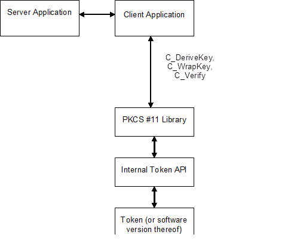

## CT-KIP

### Principles of Operation

{#figure_6}

[Figure 6] shows an integration of PKCS #11 into an application that generates
cryptographic keys through the use of CT-KIP. The application invokes
**C_DeriveKey** to derive a key of a particular type on the token. The key may
subsequently be used as a basis to e.g., generate one-time password values. The
application communicates with a CT-KIP server that participates in the key
derivation and stores a copy of the key in its database. The key is transferred
to the server in wrapped form, after a call to **C_WrapKey**. The server
authenticates itself to the client and the client verifies the authentication by
calls to **C_Verify**.

### Mechanisms

The following table shows, for the mechanisms defined in this document, their
support by different cryptographic operations. For any particular token, of
course, a particular operation may well support only a subset of the mechanisms
listed. There is also no guarantee that a token that supports one mechanism for
some operation supports any other mechanism for any other operation (or even
supports that same mechanism for any other operation).

+--------------------------------------+---------------------------------------------------+
|                                      | Functions                                         |
|                                      +-----+-----+------+-----+-------+-----+-----+------+
| Mechanism                            | ENC | SIG | SIGR |     | GENK  | WRP |     | ENCS |
|                                      |  &  |  &  |  &   | DIG |   &   |  &  | DRV |  &   |
|                                      | DEC | VER | VERR |     | GENKP | UWRP|     | DECS |
+======================================+:===:+:===:+:====:+:===:+:=====:+:===:+:===:+:====:+
| CKM_KIP_DERIVE                       |     |     |      |     |       |     |  ✓  |      |
+--------------------------------------+-----+-----+------+-----+-------+-----+-----+------+
| CKM_KIP_WRAP                         |     |     |      |     |       |  ✓  |     |      |
+--------------------------------------+-----+-----+------+-----+-------+-----+-----+------+
| CKM_KIP_MAC                          |     |  ✓  |      |     |       |     |     |      |
+--------------------------------------+-----+-----+------+-----+-------+-----+-----+------+
table: CT-KIP Mechanisms vs. applicable functions

The remainder of this section will present in detail the mechanisms and the
parameters that are supplied to them.

### Definitions

Mechanisms:

- CKM_KIP_DERIVE
- CKM_KIP_WRAP
- CKM_KIP_MAC

### CT-KIP Mechanism parameters

* **CK_KIP_PARAMS; CK_KIP_PARAMS_PTR**

**CK_KIP_PARAMS** is a structure that provides the parameters to all the CT-KIP
related mechanisms: The **CKM_KIP_DERIVE** key derivation mechanism, the
**CKM_KIP_WRAP** key wrap and key unwrap mechanism, and the **CKM_KIP_MAC**
signature mechanism. The structure is defined as follows:

~~~{.c}
typedef struct CK_KIP_PARAMS {
	CK_MECHANISM_PTR  pMechanism;
	CK_OBJECT_HANDLE  hKey;
	CK_BYTE_PTR       pSeed;
   CK_ULONG          ulSeedLen;
} CK_KIP_PARAMS;
~~~

The fields of the structure have the following meanings:

_pMechanism_
: pointer to the underlying cryptographic mechanism (e.g. AES, SHA-256)

_hKey_
: handle to a key that will contribute to the entropy of the derived key (CKM_KIP_DERIVE) or will be used in the MAC operation (CKM_KIP_MAC)

_pSeed_
: pointer to an input seed

_ulSeedLen_
: length in bytes of the input seed

**CK_KIP_PARAMS_PTR** is a pointer to a **CK_KIP_PARAMS** structure.	

### CT-KIP key derivation

The CT-KIP key derivation mechanism, denoted **CKM_KIP_DERIVE**, is a key
derivation mechanism that is capable of generating secret keys of potentially
any type, subject to token limitations.

It takes a parameter of type **CK_KIP_PARAMS** which allows for the passing of
the desired underlying cryptographic mechanism as well as some other data. In
particular, when the _hKey_ parameter is a handle to an existing key, that key
will be used in the key derivation in addition to the _hBaseKey_ of
**C_DeriveKey**. The pSeed parameter may be used to seed the key derivation
operation.

The mechanism derives a secret key with a particular set of attributes as
specified in the attributes of the template for the key.

The mechanism contributes the **CKA_CLASS** and **CKA_VALUE** attributes to the
new key. Other attributes supported by the key type may be specified in the
template for the key, or else will be assigned default initial values. Since the
mechanism is generic, the **CKA_KEY_TYPE** attribute should be set in the
template, if the key is to be used with a particular mechanism.

### CT-KIP key wrap and key unwrap

The CT-KIP key wrap and unwrap mechanism, denoted **CKM_KIP_WRAP**, is a key
wrap mechanism that is capable of wrapping and unwrapping generic secret keys.

It takes a parameter of type **CK_KIP_PARAMS**, which allows for the passing of
the desired underlying cryptographic mechanism as well as some other data. It
does not make use of the _hKey_ parameter of **CK_KIP_PARAMS**.

### CT-KIP signature generation

The CT-KIP signature (MAC) mechanism, denoted **CKM_KIP_MAC**, is a mechanism
used to produce a message authentication code of arbitrary length. The keys it
uses are secret keys.

It takes a parameter of type **CK_KIP_PARAMS**, which allows for the passing of
the desired underlying cryptographic mechanism as well as some other data. The
mechanism does not make use of the _pSeed_ and the _ulSeedLen_ parameters of
**CT_KIP_PARAMS**.

This mechanism produces a MAC of the length specified by _pulSignatureLen_
parameter in calls to **C_Sign**.

If a call to **C_Sign** with this mechanism fails, then no output will be
generated.
