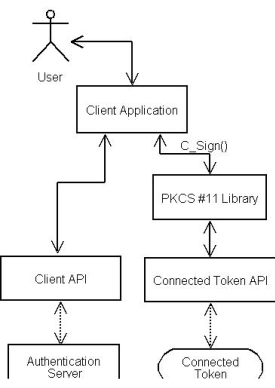
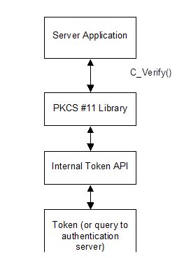
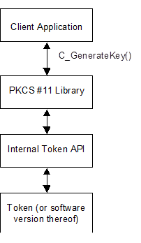

## OTP

### Usage overview

OTP tokens represented as PKCS #11 mechanisms may be used in a variety of ways.
The usage cases can be categorized according to the type of sought
functionality.

### Case 1: Generation of OTP values

{#figure_3}

[Figure 3] shows an integration of PKCS #11 into an application that needs to
authenticate users holding OTP tokens. In this particular example, a connected
hardware token is used, but a software token is equally possible. The
application invokes **C_Sign** to retrieve the OTP value from the token. In the
example, the application then passes the retrieved OTP value to a client API
that sends it via the network to an authentication server. The client API may
implement a standard authentication protocol such as RADIUS [RFC 2865] or EAP
[RFC 3748], or a proprietary protocol such as that used by RSA Security's
ACE/Agent® software.

### Case 2: Verification of provided OTP values

{#figure_4}

[Figure 4] illustrates the server-side equivalent of the scenario depicted in
[Figure 3]. In this case, a server application invokes **C_Verify** with the
received OTP value as the signature value to be verified.

### Case 3: Generation of OTP keys

{#figure_5}

Figure 5 shows an integration of PKCS #11 into an application that generates OTP
keys. The application invokes **C_GenerateKey** to generate an OTP key of a
particular type on the token. The key may subsequently be used as a basis to
generate OTP values.

### OTP Key objects

OTP key objects (object class **CKO_OTP_KEY**) hold secret keys used by OTP
tokens. The following table defines the attributes common to all OTP keys, in
addition to the attributes defined for secret keys, all of which are inherited
by this class:

| Attribute                         | Data type  | Meaning                   |
|-----------------------------------|------------|---------------------------|
| CKA_OTP_FORMAT                    | CK_ULONG   | Format of OTP values produced with this key: |
|                                   |            | CK_OTP_FORMAT_DECIMAL = Decimal (default) (UTF8-encoded) |
|                                   |            | CK_OTP_FORMAT_HEXADECIMAL = Hexadecimal (UTF8-encoded) |
|                                   |            | CK_OTP_FORMAT_ALPHANUMERIC = Alphanumeric (UTF8-encoded) |
|                                   |            | CK_OTP_FORMAT_BINARY = Only binary values. |
| CKA_OTP_LENGTH ^9^                | CK_ULONG   | Default length of OTP values (in the CKA_OTP_FORMAT) produced with this key. |
| CKA_OTP_USER_FRIENDLY_MODE ^9^    | CK_BBOOL   | Set to CK_TRUE when the token is capable of returning OTPs suitable for human consumption. See the description of CKF_USER_FRIENDLY_OTP below. |
| CKA_OTP_CHALLENGE_REQUIREMENT ^9^ | CK_ULONG   | Parameter requirements when generating or verifying OTP values with this key: |
|                                   |            | CK_OTP_PARAM_MANDATORY = A challenge must be supplied. |
|                                   |            | CK_OTP_PARAM_OPTIONAL = A challenge may be supplied but need not be. |
|                                   |            | CK_OTP_PARAM_IGNORED = A challenge, if supplied, will be ignored. |
| CKA_OTP_TIME_REQUIREMENT ^9^      | CK_ULONG   | Parameter requirements when generating or verifying OTP values with this key: |
|                                   |            | CK_OTP_PARAM_MANDATORY = A time value must be supplied. |
|                                   |            | CK_OTP_PARAM_OPTIONAL = A time value may be supplied but need not be. |
|                                   |            | CK_OTP_PARAM_IGNORED = A time value, if supplied, will be ignored. |
| CKA_OTP_COUNTER_REQUIREMENT ^9^   | CK_ULONG   | Parameter requirements when generating or verifying OTP values with this key: |
|                                   |            | CK_OTP_PARAM_MANDATORY = A counter value must be supplied. |
|                                   |            | CK_OTP_PARAM_OPTIONAL = A counter value may be supplied but need not be. |
|                                   |            | CK_OTP_PARAM_IGNORED = A counter value, if supplied, will be ignored. |
| CKA_OTP_PIN_REQUIREMENT ^9^       | CK_ULONG   | Parameter requirements when generating or verifying OTP values with this key: |
|                                   |            | CK_OTP_PARAM_MANDATORY = A PIN value must be supplied. |
|                                   |            | CK_OTP_PARAM_OPTIONAL = A PIN value may be supplied but need not be (if not supplied, then library will be responsible for collecting it) |
|                                   |            | CK_OTP_PARAM_IGNORED = A PIN value, if supplied, will be ignored. |
| CKA_OTP_COUNTER                   | Byte array | Value of the associated internal counter. Default value is empty (i.e. ulValueLen = 0). |
| CKA_OTP_TIME                      | RFC 2279 string | Value of the associated internal UTC time in the form YYYYMMDDhhmmss. Default value is empty (i.e. ulValueLen= 0). |
| CKA_OTP_USER_IDENTIFIER           | RFC 2279 string | Text string that identifies a user associated with the OTP key (may be used to enhance the user experience). Default value is empty (i.e. ulValueLen = 0). |
| CKA_OTP_SERVICE_IDENTIFIER        | RFC 2279 string | Text string that identifies a service that may validate OTPs generated by this key. Default value is empty (i.e. ulValueLen = 0). |
| CKA_OTP_SERVICE_LOGO              | Byte array | Logotype image that identifies a service that may validate OTPs generated by this key. Default value is empty (i.e. ulValueLen = 0). |
| CKA_OTP_SERVICE_LOGO_TYPE         | RFC 2279 string | MIME type of the CKA_OTP_SERVICE_LOGO attribute value. Default value is empty (i.e. ulValueLen = 0). |
| CKA_VALUE ^1,4,6,7^               | Byte array | Value of the key. |
| CKA_VALUE_LEN ^2,3^               | CK_ULONG   | Length in bytes of key value. |
table: Common OTP key attributes

- Refer to Table 13 for footnotes

Note: A Cryptoki library may support PIN-code caching in order to reduce user
interactions. An OTP-PKCS #11 application should therefore always consult the
state of the **CKA_OTP_PIN_REQUIREMENT** attribute before each call to
**C_SignInit**, as the value of this attribute may change dynamically.

For OTP tokens with multiple keys, the keys may be enumerated using
**C_FindObjects**. The **CKA_OTP_SERVICE_IDENTIFIER** and/or the
**CKA_OTP_SERVICE_LOGO** attribute may be used to distinguish between keys. The
actual choice of key for a particular operation is however application-specific
and beyond the scope of this document.

For all OTP keys, the **CKA_ALLOWED_MECHANISMS** attribute should be set as
required.

### OTP-related notifications

This document extends the set of defined notifications as follows:

CKN_OTP_CHANGED
: Cryptoki is informing the application that the OTP for a key on a connected
  token just changed. This notification is particularly useful when applications
  wish to display the current OTP value for time-based mechanisms.

