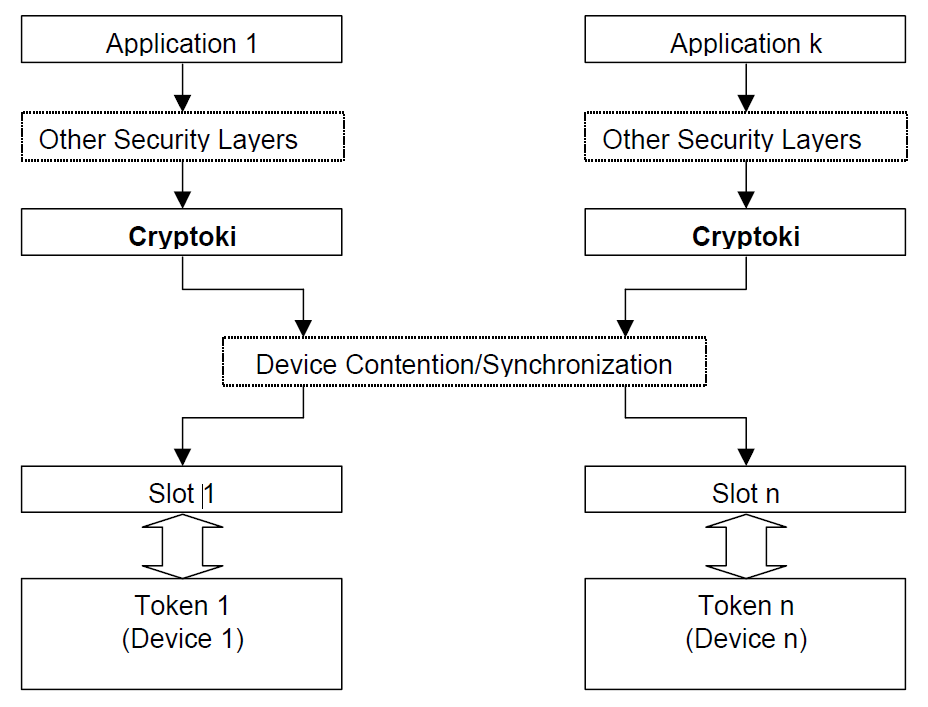
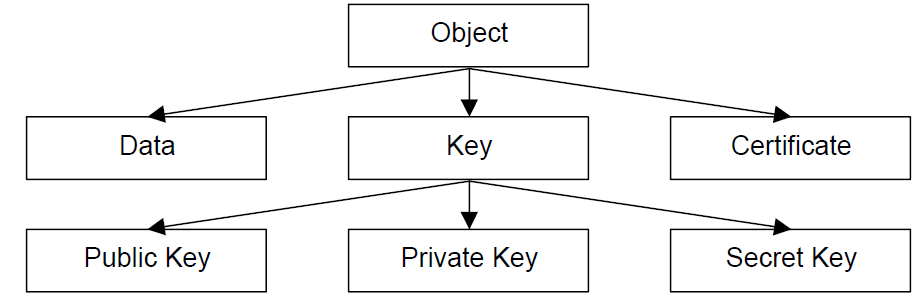
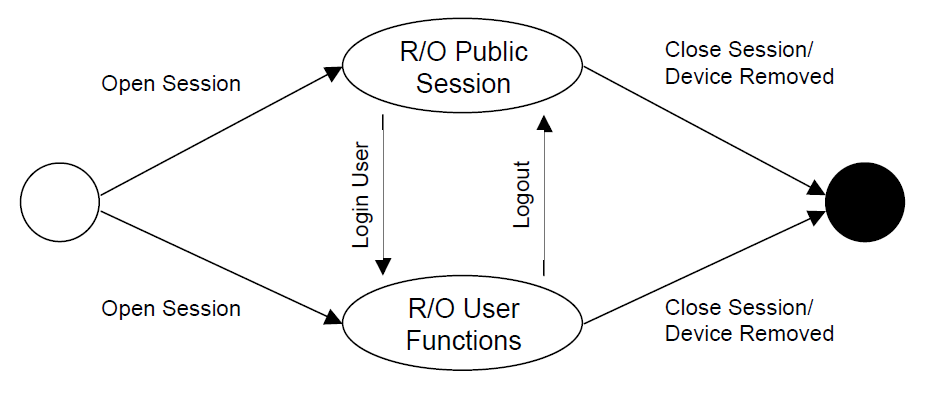
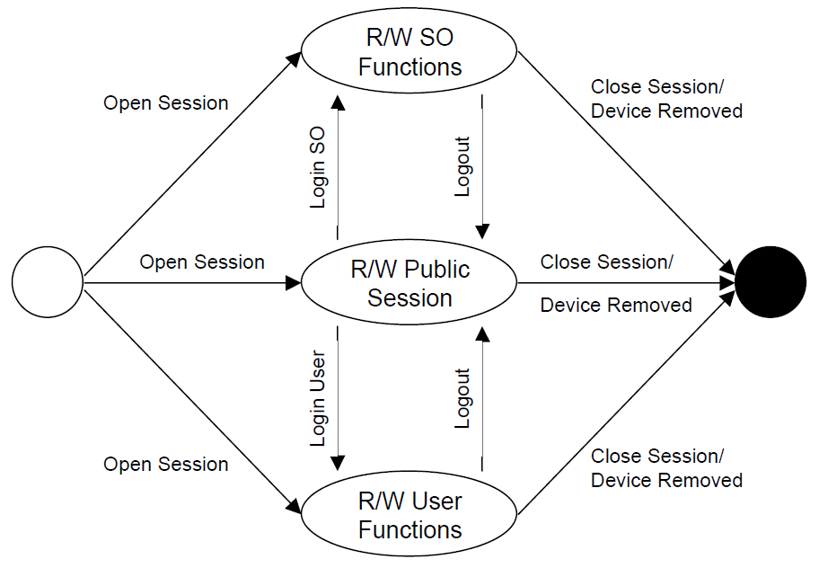

# General overview

## Introduction

Portable computing devices such as smart cards, USB token and Hardware Security
Modules are ideal tools for implementing public-key cryptography, as they
provide a way to store the private-key component of a public-key/private-key
pair securely, under the control of a single user. With such a device, a
cryptographic application, rather than performing cryptographic operations
itself, utilizes the device to perform the operations, with sensitive
information such as private keys never being revealed. As more applications are
developed for public-key cryptography, a standard programming interface for
these devices becomes increasingly valuable. This standard addresses this and
other needs.

## General model

Cryptoki's general model is illustrated in the following figure. The model
begins with one or more applications that need to perform certain cryptographic
operations, and ends with one or more cryptographic devices, on which some or
all the operations are actually performed. A user may or may not be associated
with an application.

{#figure_1}    

Cryptoki provides an interface to one or more cryptographic devices that are
active in the system through a number of "slots". Each slot, which corresponds
to a physical reader or other device interface, may contain a token. A token is
typically "present in the slot" when a cryptographic device is present in the
reader. Of course, since Cryptoki provides a logical view of slots and tokens,
there may be other physical interpretations. It is possible that multiple slots
may share the same physical reader. The point is that a system has some number
of slots, and applications can connect to tokens in any or all those slots.

A cryptographic device can perform some cryptographic operations, following a
certain command set; these commands are typically passed through standard device
drivers, for instance PCI Express card services or socket services. Cryptoki
makes each cryptographic device look logically like every other device,
regardless of the implementation technology. Thus, the application need not
interface directly to the device drivers (or even know which ones are involved);
Cryptoki hides these details. Indeed, the underlying "device" may be implemented
entirely in software (for instance, as a process running on a server)—no special
hardware is necessary.

Cryptoki is likely to be implemented as a library supporting the functions in
the interface, and applications will be linked to the library. An application
may be linked to Cryptoki directly; alternatively, Cryptoki can be a so-called
"shared" library (or dynamic link library), in which case the application would
link the library dynamically. Shared libraries are fairly straightforward to
produce in operating systems such as Microsoft Windows, and can be achieved
without too much difficulty in UNIX and Linux systems.

The dynamic approach certainly has advantages as new libraries are made
available, but from a security perspective, there are some drawbacks. In
particular, if a library is easily replaced, then there is the possibility that
an attacker can substitute a rogue library that intercepts a user's PIN. From a
security perspective, therefore, direct linking is generally preferable,
although code-signing techniques can prevent many of the security risks of
dynamic linking. In any case, whether the linking is direct or dynamic, the
programming interface between the application and a Cryptoki library remains the
same.

The kinds of devices and capabilities supported will depend on the particular
Cryptoki library. This standard specifies only the interface to the library, not
its features. In particular, not all libraries will support all the mechanisms
(algorithms) defined in this interface (since not all tokens are expected to
support all the mechanisms), and libraries will likely support only a subset of
all the kinds of cryptographic devices that are available. (The more kinds, the
better, of course, and it is anticipated that libraries will be developed
supporting multiple kinds of token, rather than just those from a single
vendor.) It is expected that as applications are developed that interface to
Cryptoki, standard library and token "profiles" will emerge.

## Logical view of a token

Cryptoki's logical view of a token is a device that stores objects and can
perform cryptographic functions. Cryptoki defines three classes of object: data,
certificates, and keys. A data object is defined by an application. A
certificate object stores a certificate. A key object stores a cryptographic
key. The key may be a public key, a private key, or a secret key; each of these
types of keys has subtypes for use in specific mechanisms. This view is
illustrated in the following figure:

{#figure_2}    

Objects are also classified according to their lifetime and visibility. "Token
objects" are visible to all applications connected to the token that have
sufficient permission, and remain on the token even after the "sessions"
(connections between an application and the token) are closed and the token is
removed from its slot. "Session objects" are more temporary: whenever a session
is closed by any means, all session objects created by that session are
automatically destroyed. In addition, session objects are only visible to the
application which created them.

Further classification defines access requirements. Applications are not
required to log into the token to view "public objects"; however, to view
"private objects", a user must be authenticated to the token by a PIN or some
other token-dependent method (for example, a biometric device). A token can
create and destroy objects, manipulate them, and search for them. It can also
perform cryptographic functions with objects. A token may have an internal
random number generator.

It is important to distinguish between the logical view of a token and the
actual implementation, because not all cryptographic devices will have this
concept of "objects," or be able to perform every kind of cryptographic
function. Many devices will simply have fixed storage places for keys of a fixed
algorithm and be able to do a limited set of operations. Cryptoki's role is to
translate this into the logical view, mapping attributes to fixed storage
elements and so on. Not all Cryptoki libraries and tokens need to support every
object type. It is expected that standard "profiles" will be developed,
specifying sets of algorithms to be supported.

"Attributes" are characteristics that distinguish an instance of an object. In
Cryptoki, there are general attributes, such as whether the object is private or
public. There are also attributes that are specific to a particular type of
object, such as a modulus or exponent for RSA keys.

## Users

This version of Cryptoki recognizes two token user types. One type is a Security
Officer (SO). The other type is the normal user. Only the normal user is allowed
access to private objects on the token, and that access is granted only after
the normal user has been authenticated. Some tokens may also require that a user
be authenticated before any cryptographic function can be performed on the
token, whether or not it involves private objects. The role of the SO is to
initialize a token and to set the normal user's PIN (or otherwise define, by
some method outside the scope of this version of Cryptoki, how the normal user
may be authenticated), and possibly to manipulate some public objects. The
normal user cannot log in until the SO has set the normal user's PIN.

Other than the support for two types of users, Cryptoki does not address the
relationship between the SO and a community of users. In particular, the SO and
the normal user may be the same person or may be different, but such matters are
outside the scope of this standard.

With respect to PINs that are entered through an application, Cryptoki assumes
only that they are variable-length strings of characters from the set in
[PKCS11-Spec-v3.2] Table 3. Any translation to the device's requirements is left
to the Cryptoki library. The following issues are beyond the scope of Cryptoki:

- Any padding of PINs.
- How the PINs are generated (by the user, by the application, or by some other means).

PINs that are supplied by some means other than through an application (e.g.,
PINs entered via a PIN pad on the token) are even more abstract. Cryptoki knows
how to wait (if need be) for such a PIN to be supplied and used, and little
more.

## Applications and their use of Cryptoki

### General Guidance

To Cryptoki, an application consists of a single address space and all the
threads of control running in it. An application becomes a "Cryptoki
application" by calling the Cryptoki function **C_Initialize** from one of its
threads; after this call is made, the application can call other Cryptoki
functions. When the application has finished using Cryptoki, it calls the
Cryptoki function **C_Finalize** and ceases to be a Cryptoki application.

### Applications and processes

In general, on most platforms, the previous paragraph means that an application
consists of a single process.

Consider a UNIX process **P** which becomes a Cryptoki application by calling
**C_Initialize**, and then uses the `fork()` system call to create a child
process **C**. Since **P** and **C** have separate address spaces (or will when
one of them performs a write operation, if the operating system follows the
copy-on-write paradigm), they are not part of the same application. Therefore,
if **C** needs to use Cryptoki, it needs to perform its own **C_Initialize**
call.  Furthermore, if **C** needs to be logged into the token(s) that it will
access via Cryptoki, it needs to log into them _even if **P** is already logged
in_, since **P** and **C** are separate applications.

In this particular case (when **C** is the child of a process which is a
Cryptoki application), the behavior of Cryptoki is undefined if **C** tries to
use it without its own **C_Initialize** call. Ideally, such an attempt would
return the value `CKR_CRYPTOKI_NOT_INITIALIZED`; however, because of the way
`fork()` works, insisting on this return value might have a bad impact on the
performance of libraries. Therefore, the behavior of Cryptoki in this situation
is left undefined. Applications should definitely not attempt to take advantage
of any potential "shortcuts" which might (or might not!) be available because of
this.

In the scenario specified above, **C** should actually call **C_Initialize**
whether or not it needs to use Cryptoki; if it has no need to use Cryptoki, it
should then call **C_Finalize** immediately thereafter. This (having the child
immediately call **C_Initialize** and then call **C_Finalize** if the parent is
using Cryptoki) is considered to be good Cryptoki programming practice, since it
can prevent the existence of dangling duplicate resources that were created at
the time of the `fork()` call; however, it is not required by Cryptoki.

### Applications and threads

Some applications will access a Cryptoki library in a multi-threaded fashion.
Cryptoki enables applications to provide information to libraries so that they
can give appropriate support for multi-threading. In particular, when an
application initializes a Cryptoki library with a call to **C_Initialize**, it
can specify one of four possible multi-threading behaviors for the library:

1. The application can specify that it will not be accessing the library
   concurrently from multiple threads, and so the library need not worry about
   performing any type of locking for the sake of thread-safety.
2. The application can specify that it will be accessing the library
   concurrently from multiple threads, and the library must be able to use
   native operation system synchronization primitives to ensure proper
   thread-safe behavior.
3. The application can specify that it will be accessing the library
   concurrently from multiple threads, and the library must use a set of
   application-supplied synchronization primitives to ensure proper thread-safe
   behavior.
4. The application can specify that it will be accessing the library
   concurrently from multiple threads, and the library must use either the
   native operating system synchronization primitives or a set of
   application-supplied synchronization primitives to ensure proper thread-safe
   behavior.

The 3^rd^ and 4^th^ types of behavior listed above are appropriate for
multi-threaded applications that are not using the native operating system
thread model. The application-supplied synchronization primitives consist of
four functions for handling mutex (mutual exclusion) objects in the
application's threading model. Mutex objects are simple objects that can be in
either of two states at any given time: unlocked or locked. If a call is made by
a thread to lock a mutex that is already locked, that thread blocks (waits)
until the mutex is unlocked; then it locks it and the call returns. If more than
one thread is blocking on a particular mutex, and that mutex becomes unlocked,
then exactly one of those threads will get the lock on the mutex and return
control to the caller (the other blocking threads will continue to block and
wait for their turn).

See [PKCS11-Spec-v3.2] section 5.1.5 for more information on Cryptoki's view of
mutex objects.

In addition to providing the above thread-handling information to a Cryptoki
library at initialization time, an application can also specify whether or not
application threads executing library calls may use native operating system
calls to spawn new threads.

## Sessions

### General Guidance

Cryptoki requires that an application open one or more sessions with a token to
gain access to the token's objects and functions. A session provides a logical
connection between the application and the token. A session can be a read/write
(R/W) session or a read-only (R/O) session. Read/write and read-only refer to
the access to token objects, not to session objects. In both session types, an
application can create, read, write and destroy session objects, and read token
objects. However, only in a read/write session can an application create,
modify, and destroy token objects.

After it opens a session, an application has access to the token's public
objects. All threads of a given application have access to exactly the same
sessions and the same session objects. To gain access to the token's private
objects, the normal user must log in and be authenticated.

When a session is closed, any session objects which were created in that session
are destroyed. This holds even for session objects that are "being used" by
other sessions. That is, if a single application has multiple sessions open with
a token, and it uses one of them to create a session object, then that session
object is visible through any of that application's sessions. However, as soon
as the session that was used to create the object is closed, that object is
destroyed.

Cryptoki supports multiple sessions on multiple tokens. An application may have
one or more sessions with one or more tokens. In general, a token may have
multiple sessions with one or more applications. A particular token may allow an
application to have only a limited number of sessions—or only a limited number
of read/write sessions-- however.

An open session can be in one of several states. The session state determines
allowable access to objects and functions that can be performed on them. The
session states are described in section 2.6.2 and section 2.6.3.

### Read-only session states

A read-only session can be in one of two states, as illustrated in the following
figure. When the session is initially opened, it is in either the "R/O Public
Session" state (if the application has no previously open sessions that are
logged in) or the "R/O User Functions" state (if the application already has an
open session that is logged in). Note that read-only SO sessions do not exist.
Read-only sessions that are open while the SO is logged in behave identically to
the "R/O Public Session" state.

{#figure_3}    

The following table describes the session states:

| State              | Description                                           |
|--------------------|-------------------------------------------------------|
| R/O Public Session | The application has opened a read-only session. The application has read-only access to public token objects and read/write access to public session objects. |
| R/O User Functions | The normal user has been authenticated to the token. The application has read-only access to all token objects (public or private) and read/write access to all session objects (public or private). |
table: Read-Only Session States

### Read/write session states

A read/write session can be in one of three states, as illustrated in the
following figure. When the session is opened, it is in either the "R/W Public
Session" state (if the application has no previously open sessions that are
logged in), the "R/W User Functions" state (if the application already has an
open session that the normal user is logged into), or the "R/W SO Functions"
state (if the application already has an open session that the SO is logged
into).

{#figure_4}    

The following table describes the session states:

| State              | Description                                           |
|--------------------|-------------------------------------------------------|
| R/W Public Session | The application has opened a read/write session. The application has read/write access to all public objects. |
| R/W SO Functions   | The Security Officer has been authenticated to the token. The application has read/write access only to public objects on the token, not to private objects. The SO can set the normal user's PIN. |
| R/W User Functions | The normal user has been authenticated to the token. The application has read/write access to all objects. |
table: Read-Write Session States

### Permitted object accesses by sessions

The following table summarizes the kind of access each type of session has to
each type of object. A given type of session has either read-only access,
read/write access, or no access whatsoever to a given type of object.

Note that creating or deleting an object requires read/write access to it, e.g.,
a "R/O User Functions" session cannot create or delete a token object.

+------------------------+--------------------------------------------------------+
|                        | Type of sesion                                         |
| Type of object         +------------+------------+----------+----------+--------+
|                        | R/O Public | R/W Public | R/O User | R/W User | R/W SO |
+========================+:==========:+:==========:+:========:+:========:+:======:+
| Public session object  |    R/W     |     R/W    |    R/W   |    R/W   |   R/W  |
+------------------------+------------+------------+----------+----------+--------+
| Private session object |            |            |    R/W   |    R/W   |        |
+------------------------+------------+------------+----------+----------+--------+
| Public token object    |    R/O     |     R/W    |    R/O   |    R/W   |   R/W  |
+------------------------+------------+------------+----------+----------+--------+
| Private token object   |            |            |    R/O   |    R/W   |        |
+------------------------+------------+------------+----------+----------+--------+
table: Access to different types of objects by different types of sessions

As previously indicated, the access to a given session object which is shown in
Table 3 is limited to sessions belonging to the application which owns that
object (i.e., which created that object).

### Session events

Session events cause the session state to change. The following table describes the events:

+----------------+-----------------------------------------------------------------+
| Event          | Occurs when...                                                  |
+----------------+-----------------------------------------------------------------+
| Log In SO      | the SO is authenticated to the token.                           |
+----------------+-----------------------------------------------------------------+
| Log In User    | the normal user is authenticated to the token.                  |
+----------------+-----------------------------------------------------------------+
| Log Out        | the application logs out the current user (SO or normal user).  |
+----------------+-----------------------------------------------------------------+
| Close Session  | the application closes the session or closes all sessions.      |
+----------------+-----------------------------------------------------------------+
| Device Removed | the device underlying the token has been removed from its slot. |
+----------------+-----------------------------------------------------------------+
table: Session events

When the device is removed, all sessions of all applications are automatically
logged out. Furthermore, all sessions any applications have with the device are
closed (this latter behavior was not present in Version 1.0 of Cryptoki) - an
application cannot have a session with a token that is not present.
Realistically, Cryptoki may not be constantly monitoring whether or not the
token is present, and so the token's absence could conceivably not be noticed
until a Cryptoki function is executed. If the token is re-inserted into the slot
before that, Cryptoki might never know that it was missing.

In Cryptoki, all sessions that an application has with a token must have the
same login/logout status (i.e., for a given application and token, one of the
following holds: all sessions are public sessions; all sessions are SO sessions;
or all sessions are user sessions). When an application's session logs into a
token, all that application's sessions with that token become logged in, and
when an application's session logs out of a token, all of that application's
sessions with that token become logged out. Similarly, for example, if an
application already has a R/O user session open with a token, and then opens a
R/W session with that token, the R/W session is automatically logged in.

This implies that a given application may not simultaneously have SO sessions
and user sessions open with a given token.

### Session handles and object handles

A session handle is a Cryptoki-assigned value that identifies a session. It is
in many ways akin to a file handle, and is specified to functions to indicate
which session the function should act on. All threads of an application have
equal access to all session handles. That is, anything that can be accomplished
with a given file handle by one thread can also be accomplished with that file
handle by any other thread of the same application.

Cryptoki also has object handles, which are identifiers used to manipulate
Cryptoki objects. Object handles are similar to session handles in the sense
that visibility of a given object through an object handle is the same among all
threads of a given application. R/O sessions, of course, only have read-only
access to token objects, whereas R/W sessions have read/write access to token
objects.

Valid session handles and object handles in Cryptoki always have nonzero values.
For developers' convenience, Cryptoki defines the following symbolic value:

```c
    CK_INVALID_HANDLE
```

### Capabilities of sessions

Very roughly speaking, there are three broad types of operations an open session
can be used to perform: administrative operations (such as logging in); object
management operations (such as creating or destroying an object on the token);
and cryptographic operations (such as computing a message digest). Cryptographic
operations sometimes require more than one function call to the Cryptoki API to
complete. In general, a single session can perform only one operation at a time;
for this reason, it may be desirable for a single application to open multiple
sessions with a single token. For efficiency's sake, however, a single session
on some tokens can perform the following pairs of operation types
simultaneously: message digesting and encryption; decryption and message
digesting; signature or MACing and encryption; and decryption and verifying
signatures or MACs. Details on performing simultaneous cryptographic operations
in one session are provided in [PKCS11-Spec-v3.2] section 5.20.

A consequence of the fact that a single session can, in general, perform only
one operation at a time is that an application should never make multiple
simultaneous function calls to Cryptoki which use a common session. If multiple
threads of an application attempt to use a common session concurrently in this
fashion, Cryptoki does not define what happens. This means that if multiple
threads of an application all need to use Cryptoki to access a particular token,
it might be appropriate for each thread to have its own session with the token,
unless the application can ensure by some other means (e.g., by some locking
mechanism) that no sessions are ever used by multiple threads simultaneously.
This is true regardless of whether or not the Cryptoki library was initialized
in a fashion which permits safe multi-threaded access to it. Even if it is safe
to access the library from multiple threads simultaneously, it is still not
necessarily safe to use a particular session from multiple threads
simultaneously.

### Example of use of sessions

We give here a detailed and lengthy example of how multiple applications can
make use of sessions in a Cryptoki library. Despite the somewhat painful level
of detail, we highly recommend reading through this example carefully to
understand session handles and object handles.

We caution that our example is decidedly not meant to indicate how multiple
applications should use Cryptoki simultaneously; rather, it is meant to clarify
what uses of Cryptoki's sessions and objects and handles are permissible. In
other words, instead of demonstrating good technique here, we demonstrate
"pushing the envelope".

For our example, we suppose that two applications, **A** and **B**, are using a
Cryptoki library to access a single token **T**. Each application has two
threads running: **A** has threads **A1** and **A2**, and **B** has threads
**B1** and **B2**. We assume in what follows that there are no instances where
multiple threads of a single application simultaneously use the same session,
and that the events of our example occur in the order specified, without
overlapping each other in time.

1. **A1** and **B1** each initialize the Cryptoki library by calling
   **C_Initialize** (see [PKCS11-Spec-v3.2] for explanation of the specifics of
   Cryptoki functions). Note that exactly one call to **C_Initialize** should be
   made for each application (as opposed to one call for every thread, for
   example).
2. **A1** opens a R/W session and receives the session handle 7 for the session.
   Since this is the first session to be opened for **A**, it is a public
   session.
3. **A2** opens a R/O session and receives the session handle 4. Since all of
   **A**'s existing sessions are public sessions, session 4 is also a public
   session.
4. **A1** attempts to log the SO into session 7. The attempt fails, because
   read-only sessions cannot be used to log in the SO.
5. **A2** logs the normal user into session 7. This turns session 7 into a R/W
   user session and turns session 4 into a R/O user session. Note that because
   **A1** and **A2** belong to the same application, they have equal access to
   all sessions, and therefore, **A2** is able to perform this action.
6. **A2** opens a R/W session and receives the session handle 9. Since all of
   **A**'s existing sessions are user sessions, session 9 is also a user
   session.
7. **A1** closes session 9.
8. **B1** attempts to log out session 4. The attempt fails, because **A** and
   **B** have no access rights to each other's sessions or objects. **B1**
   receives an error message which indicates that there is no such session
   handle (CKR_SESSION_HANDLE_INVALID).
9. **B2** attempts to close session 4. The attempt fails in precisely the same
   way as **B1**'s attempt to log out session 4 failed (i.e., **B2** receives a
   CKR_SESSION_HANDLE_INVALID error code).
10. **B1** opens a R/W session and receives the session handle 7. Note that, as
    far as **B** is concerned, this is the first occurrence of session handle 7.
    **A**'s session 7 and **B**'s session 7 are completely different sessions.
11. **B1** logs the SO into [**B**'s] session 7. This turns **B**'s session 7
    into a R/W SO session and has no effect on either of **A**'s sessions.
12. **A1** uses [**A**'s] session 7 to create a session object **O1** of some
    sort and receives the object handle 7. Note that a Cryptoki implementation
    may or may not support separate spaces of handles for sessions and objects.
13. **B1** uses [**B**'s] session 7 to create a token object **O2** of some sort
    and receives the object handle 7. As with session handles, different
    applications have no access rights to each other's object handles, and so
    **B**'s object handle 7 is entirely different from **A**'s object handle 7.
    Of course, since **B1** is an SO session, it cannot create private objects,
    and so **O2** must be a public object (if **B1** attempted to create a
    private object, the attempt would fail with error code
    CKR_USER_NOT_LOGGED_IN or CKR_TEMPLATE_INCONSISTENT).
14. **B2** uses [**B**'s] session 7 to perform some operation to modify the
    object associated with [**B**'s] object handle 7. This modifies **O2**.
15. **A1** uses [**A**'s] session 4 to perform an object search operation to get
    a handle for **O2**. The search returns object handle 1. Note that **A**'s
    object handle 1 and **B**'s object handle 7 now point to the same object.
16. **A1** attempts to use [**A**'s] session 4 to modify the object associated
    with [**A**'s] object handle 1. The attempt fails, because **A**'s session 4
    is a R/O session, and is therefore incapable of modifying **O2**, which is a
    token object. **A1** receives an error message indicating that the session
    is a R/O session (CKR_SESSION_READ_ONLY).
17. **A1** uses [**A**'s] session 7 to modify the object associated with
    [**A**'s] object handle 1. This time, since **A**'s session 7 is a R/W
    session, the attempt succeeds in modifying **O2**.
18. **B1** uses [**B**'s] session 7 to perform an object search operation to
    find **O1**. Since **O1** is a session object belonging to **A**, however,
    the search does not succeed.
19. **A2** uses [**A**'s] session 4 to perform some operation to modify the
    object associated with [**A**'s] object handle 7. This operation modifies
    **O1**.
20. **A2** uses [**A**'s] session 7 to destroy the object associated with
    [**A**'s] object handle 1. This destroys **O2**.
21. **B1** attempts to perform some operation with the object associated with
    [**B**'s] object handle 7. The attempt fails, since there is no longer any
    such object. **B1** receives an error message indicating that its object
    handle is invalid (CKR_OBJECT_HANDLE_INVALID).
22. **A1** logs out [**A**'s] session 4. This turns **A**'s session 4 into a R/O
    public session and turns **A**'s session 7 into a R/W public session.
23. **A1** closes [**A**'s] session 7. This destroys the session object **O1**,
    which was created by **A**'s session 7.
24. **A2** attempts to use [**A**'s] session 4 to perform some operation with
    the object associated with [**A**'s] object handle 7. The attempt fails,
    since there is no longer any such object. It returns a
    CKR_OBJECT_HANDLE_INVALID.
25. **A2** executes a call to **C_CloseAllSessions**. This closes [**A**'s]
    session 4. At this point, if **A** were to open a new session, the session
    would not be logged in (i.e., it would be a public session).
26. **B2** closes [**B**'s] session 7. At this point, if **B** were to open a
    new session, the session would not be logged in.
27. **A** and **B** each call **C_Finalize** to indicate that they are done with
    the Cryptoki library.

Modules implementing previous versions of PKCS #11 may return the
CKR_SESSION_READ_ONLY_EXISTS and CKR_SESSION_READ_WRITE_SO_EXISTS error codes.
